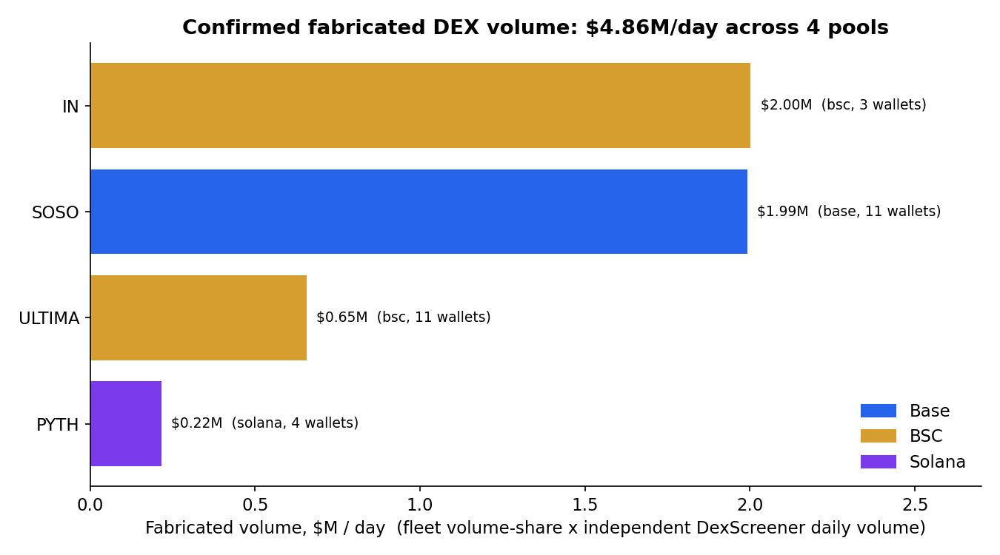
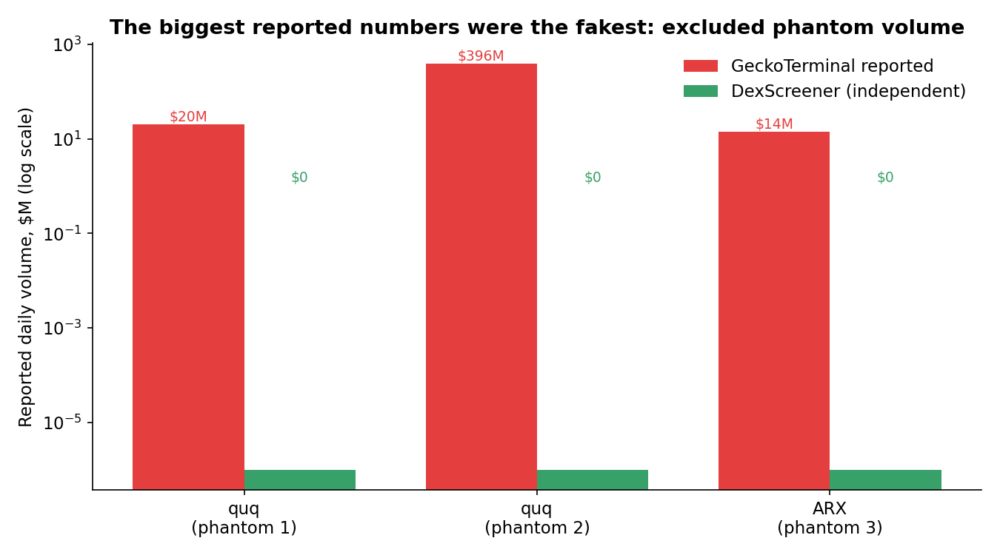
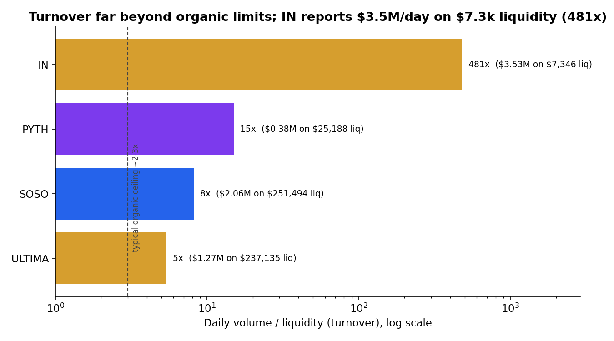
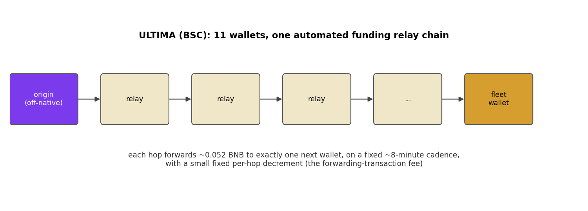

## Summary

Six low-cap pools on Uniswap, PancakeSwap, and Orca (spread across Base, BNB Chain, and Solana) reported a combined 8.3 million dollars in trading volume in a single day. Cross-sourced against a second independent data provider and the raw on-chain trade tape, about 5.6 million dollars of that (roughly two thirds) is fabricated by small fleets of bots trading against themselves. One pool, IN/WBNB on PancakeSwap, reported 3.5 million dollars of daily volume against 7,346 dollars of liquidity, a turnover of 481 times per day.

The point of this post is not that wash trading exists on obscure tokens (that is expected). It is threefold: that the fabrication is measurable and separable from real volume with public data; that the single largest "volume" numbers in the sample are the ones with zero corroboration and should be discarded rather than reported; and that the operators leave a clean, automated on-chain funding signature. Every number below is reproducible from the companion repository, and a `verify.py` script re-derives each one from the committed data.

## Data and scope

The screen uses three public sources, none of which requires a paid tier:

- **GeckoTerminal** (`api.geckoterminal.com`) for the pool universe and the per-trade tape (trader address, side, USD size, transaction hash, timestamp).
- **DexScreener** (`api.dexscreener.com`) as an independent second measurement of each pool's daily volume and liquidity.
- **Public JSON-RPC and Bitquery** for on-chain funding attribution (native-token transfers and `eth_getCode`).

Starting from the established (non-launch) pool feeds on six chains, the screen keeps pools that are at least two days old with 10,000 to 3,000,000 dollars of liquidity, at least 300 daily trades, and daily volume of at least five times liquidity. That filter yields the candidate set analysed here: **73 pools screened**. This is a targeted census of high-turnover, low-cap pools, not an estimate across all DEX activity, and the prevalence figures should be read as conditional on that screen.

## Detection method

A wash-trading fleet is a group of wallets that buy and sell the same token in near-equal amounts, so that gross volume is large while net position change is near zero. The detector flags a pool when a set of wallets each records at least three buys and three sells with balanced counts (the difference no greater than a quarter of their total), those wallets account for at least half of the sampled trades, and the pool-wide net-to-gross ratio is within 0.15 of zero. A pool must also show sustained activity: at least seven active days in its 60-day daily-volume history. Balanced two-sided flow at scale, with no accumulation, is the wash signature (Figure 4).

The single most important methodological choice is to **not trust any one provider's volume field**. Aggregator volume on a manipulated pool is often itself fabricated. Manufactured volume is therefore computed as the fleet's share of measured trade volume multiplied by the pool's daily volume **as reported independently by DexScreener**, and any flagged pool that DexScreener will not corroborate (daily volume under 50,000 dollars, or not indexed at all) is excluded from the headline entirely.

## Findings

### The census

Of 73 screened pools, 10 were flagged on mechanics, 9 were sustained, and **6 were corroborated by the independent source**. The corroborated fabricated volume totals **5,636,894 dollars per day** (as of 2026-07-01).

| Pool | Chain | Fleet wallets | Fleet volume share | Independent daily volume | Fabricated / day |
|------|-------|:---:|:---:|--:|--:|
| IN / WBNB | BNB Chain | 3 | 0.569 | $3,534,262 | $2,010,995 |
| SOSO / USDC | Base | 12 | 0.976 | $2,057,890 | $2,008,501 |
| ULTIMA / USDT | BNB Chain | 11 | 0.523 | $1,272,958 | $665,757 |
| DUAL / ETH | Base | 10 | 1.000 | $370,758 | $370,758 |
| BASED / USDT | BNB Chain | 2 | 0.522 | $704,624 | $367,813 |
| PYTH / SOL | Solana | 4 | 0.565 | $377,115 | $213,070 |

### The biggest reported numbers were the fakest

Three pools flagged on mechanics were thrown out because the independent source shows no volume at all. The clearest case is a BNB Chain pool for the token quq: GeckoTerminal reported **395,507,943 dollars** of daily volume, while DexScreener does not index the pool and shows zero. A second quq pool (20 million reported) and an ARX pool (14 million reported) show the same pattern. Had this study taken aggregator volume at face value, its headline would have been roughly 430 million dollars per day, and it would have been almost entirely fictional (Figure 2).

This is the reason the corroboration step exists. The most eye-catching numbers in the raw data were the least real.

### Turnover beyond physical limits

Every corroborated pool trades far faster than its liquidity can organically support. A pool's daily volume divided by its liquidity (its turnover) rarely exceeds two or three for a normally traded asset. All six exceed five. IN/WBNB is the extreme: 3.5 million dollars of daily volume on 7,346 dollars of liquidity, a turnover of **481 times per day**, across 78,233 transactions (Figure 3). No organic market moves a 7,000-dollar pool three and a half million dollars a day; the volume is manufactured by a handful of wallets cycling the same funds.

### Three flagship pools

**SOSO / USDC (Base, Uniswap).** Twelve wallets form a balanced fleet that accounts for **97.6 percent** of sampled trade volume. This is not a stale snapshot: a fresh pull of the live tape shows all twelve wallets still present and still **98.7 percent** of the last 300 trades, each wallet buying and selling in near-equal counts. Example fleet transaction: `0x64b49d3eae370472a16b94ef3569d15c7a078b95a83425cf3f4675836edcc65c` (wallet `0x3d42f45c91279337d6a0fe76a16889288fc767b6`).

**IN / WBNB (BNB Chain, PancakeSwap).** Just three wallets (`0xc86dc628...`, `0xc3f5edd0...`, `0x7afab429...`) produce the 481-times turnover, each ping-ponging thousands of micro-trades. On the live tape they are **83 percent** of the last 300 trades. Example transaction: `0x6467f6c800200ed7b39b604db273186fd48cdd5bc7ae4ea7d966a70f6b70a812`.

**ULTIMA / USDT (BNB Chain, Uniswap).** Eleven wallets, each executing a mechanical pattern of matched buys and sells (in the sampled window every fleet wallet did exactly three buys and three sells). ULTIMA's fleet share varies by window (0.52 in the captured window, 0.20 in a later one), so its dollar figure is the most conservative in the table and is best read as a floor. What makes ULTIMA the clearest case is not its size but its funding (below).

### Operator attribution

The mechanics prove self-trading; the funding graph identifies coordination. Tracing native-token (BNB) transfers upward from the fleet wallets on BNB Chain gives three distinct pictures:

**ULTIMA is a single automated operator.** All eleven wallets belong to one closed funding chain. Each wallet receives roughly 0.052 BNB and forwards to exactly one next wallet, on a fixed cadence of about eight minutes, with a fixed per-hop decrement equal to the forwarding-transaction gas. This is a purpose-built gas-distribution pipeline whose only function is to keep a chain of trading wallets funded while obscuring the source (Figure 5). A linear chain in which every node has exactly one downstream recipient, on a regular timer, is not organic behaviour.

**IN is a separate, smaller operator.** Its wallets trace to a short chain of throwaway externally-owned accounts (`0x50560acf...` funding `0x40068df75...` funding the fleet), each with only a couple of transactions. Same idea, different hand.

**BASED reuses a wallet across tokens.** The wallet `0x9999b0cdd35d7f3b281ba02efc0d228486940515` appears in both the BASED and the ARX fleets, the only cross-token wallet reuse in the dataset, which ties those two operations to one operator.

Critically, the three BNB-Chain operations do **not** share any funding ancestor. This is a decentralised pattern: many independent operators each fabricating volume on their own token, not one actor behind all of them. All flagged fleet wallets are externally-owned accounts (verified by `eth_getCode`), not router or market-maker contracts, so the balanced flow is deliberate self-trading rather than an artifact of contract routing.

## Limitations

The fleet's share of volume is measured from a sampled window of the trade tape and varies between windows, most notably for ULTIMA; the reported dollar figures are therefore estimates anchored to the median measured daily volume, and ULTIMA's should be treated as a floor. The screen is a targeted census of high-turnover, low-cap pools, so the prevalence (6 corroborated of 73 screened) is conditional on that filter and is not an estimate over all DEX pools. The evidence establishes self-trading and single-operator funding structures; it does not establish intent or identity beyond the on-chain wallets, and manufactured volume of this kind can serve either deliberate manipulation or an exchange or launchpad incentive program that rewards reported volume. The top of each funding chain terminates where funds arrive off-native (for example from a bridge or a centralized exchange), which on-chain data alone cannot pierce.

## Reproducibility

Everything here regenerates from the companion repository. `runner.py` performs the screen, `aggregate.py` applies the cross-source corroboration, `attribution.py` traces the funding graph, `eoa_check.py` confirms the wallets are externally-owned, and `verify.py` re-derives every number in this post from the committed data and exits non-zero on any mismatch. The DexScreener snapshot and the live trade-tape re-check are dated and included as data files.

Companion repository and exact commit are linked with this submission.

## References

- GeckoTerminal API: https://api.geckoterminal.com
- DexScreener API: https://docs.dexscreener.com/api/reference
- Bitquery EVM Transfers API: https://docs.bitquery.io
- Cao, Li, Wang et al., "Wash trading in centralized and decentralized markets," on the net-to-gross and balanced-flow signatures of wash trading.
