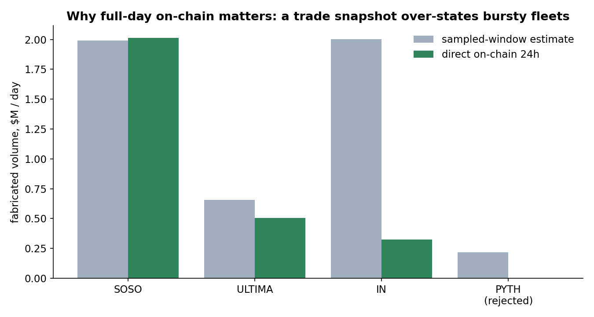
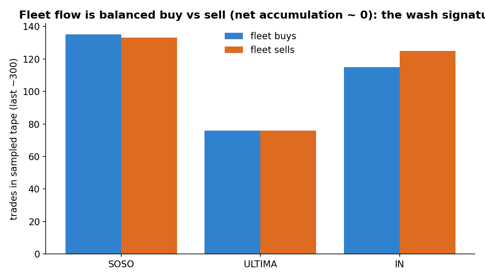

## Summary

This study screens high-turnover, low-cap DEX pools for wash trading, then puts every candidate through three independent filters before counting a dollar of it. What survives is measured directly on-chain: for the confirmed pools, the fleet's actual 24-hour trading volume, read from the chain, is the fabricated volume. Across three pools on Base and BNB Chain that comes to **2,845,587 dollars per day**.

The filters carry the argument. First, the loudest reported numbers are fictional: one pool showed 395,507,943 dollars of daily volume on GeckoTerminal and zero on an independent source. Second, some pools that pass the volume check are traded by smart contracts (routers and aggregators), not the externally-owned wallets that define deliberate self-trading. Third, and most important, a single trade-tape snapshot over-states bursty fleets, so the estimate is replaced by a full 24-hour on-chain measurement; that step alone cut one pool's figure by six-fold and rejected another outright. Every number below is re-derived from the committed data by a `verify.py` script in the companion repository.

## Data and scope

Four public sources, none requiring a paid tier:

- **GeckoTerminal** for the pool universe and the per-trade tape (trader address, side, USD size, transaction hash, timestamp).
- **DexScreener** as an independent second measurement of each pool's daily volume and liquidity.
- **Bitquery** DEX trades for the direct full-day on-chain volume measurement (EVM), plus **public JSON-RPC** for `eth_getCode` and token balances.
- **Helius** for the equivalent on-chain check on Solana.

Starting from the established (non-launch) pool feeds on six chains, the screen keeps pools at least two days old with 10,000 to 3,000,000 dollars of liquidity, at least 300 daily trades, and daily volume of at least five times liquidity: **73 pools screened**. This is a targeted census of high-turnover, low-cap pools, not an estimate over all DEX activity.

## Detection method

A wash-trading fleet is a set of wallets that buy and sell the same token in near-equal amounts, so gross volume is large while net position is near zero. The screen flags a pool when a group of wallets each records at least three buys and three sells with balanced counts, those wallets are at least half of the sampled trades, and the pool-wide net-to-gross ratio is within 0.15 of zero (Figure 4). A pool must also be sustained: at least seven active days of volume history.

Three filters then decide what counts:

1. **Independent-volume corroboration.** Aggregator volume on a manipulated pool is often itself fabricated, so a flag is dropped unless DexScreener independently shows meaningful volume (daily volume above 50,000 dollars).
2. **Contract-fleet check.** The trader recorded for a swap can be a smart contract (a router, an aggregator, or a Uniswap v4 pool manager) rather than a person's wallet. For every EVM pool the detector runs `eth_getCode` on each fleet wallet and keeps only externally-owned accounts; a pool needs at least two.
3. **Direct on-chain full-day measurement.** The screen's fleet share comes from a roughly 300-trade window, which over-represents a fleet that trades in bursts. For the confirmed pools the fleet's real 24-hour USD volume is read directly from the chain (Bitquery on EVM, Helius on Solana). That on-chain figure, not the window extrapolation, is the reported fabricated volume, and the pool total measured this way agrees with DexScreener independently.

## Findings

### The census

Of 73 screened pools, 10 flagged on mechanics and 9 were sustained. Three cleared all three filters. Measured directly on-chain over 24 hours, their fabricated volume totals **2,845,587 dollars per day**.

| Pool | Chain | EOA fleet | On-chain fabricated / day | Fleet share of pool (24h) | Pool volume (24h) |
|------|-------|:---:|--:|:---:|--:|
| SOSO / USDC | Base | 11 | $2,014,730 | 98.9% | $2,037,268 |
| ULTIMA / USDT | BNB Chain | 11 | $506,707 | 42.0% | $1,206,839 |
| IN / WBNB | BNB Chain | 3 | $324,150 | 9.3% | $3,477,696 |

### Why a snapshot is not enough

The screen flags on a short window of the trade tape. For fleets that trade in bursts, that window catches them mid-burst and overstates their share. The full 24-hour on-chain measurement corrects this (Figure 6). SOSO barely moves: its fleet is 98.9 percent of the pool over the whole day, exactly as the snapshot suggested. ULTIMA drops modestly. IN collapses: the snapshot implied about 2 million dollars a day, but over 24 hours the three identified wallets are only 9.3 percent of the pool, about 324,000 dollars. A fourth pool, PYTH on Solana, was rejected entirely: its snapshot implied 216,000 dollars, but the on-chain check (via Helius) found the wallets trade PYTH essentially not at all over a full day (206 dollars, 0.1 percent); they are generic multi-token bots that happened to be balanced in the sampled window.

### Exclusion gate 1: phantom volume

Three pools flagged on mechanics were dropped because the independent source shows no volume at all. The clearest is a BNB Chain pool for the token quq: GeckoTerminal reported **395,507,943 dollars** of daily volume; DexScreener does not index the pool and shows zero. A second quq pool (20 million reported) and an ARX pool (14 million reported) show the same pattern. These three alone would have added roughly 430 million dollars per day of fictional volume had the study trusted aggregator numbers (Figure 2).

### Exclusion gate 2: contracts, not traders

Two pools cleared the volume check but failed the contract check. DUAL/ETH on Base is a Uniswap v4 pool whose flagged fleet is nine smart contracts and a single externally-owned wallet; BASED/USDT on BNB Chain has one externally-owned wallet and one contract. Balanced flow routed through shared contracts cannot be separated from organic trading aggregated by a router, so both are dropped. This also corrects a tempting but wrong inference: the wallet that appears in both the BASED and ARX fleets is itself a contract, which is why it shows up across pools. It is shared infrastructure, not a shared operator.

### Turnover beyond physical limits

Every confirmed pool trades far faster than its liquidity can organically support. A pool's daily volume divided by its liquidity rarely exceeds two or three for a normally traded asset; all three exceed five. IN/WBNB is the extreme: 3.5 million dollars of daily volume on 7,346 dollars of liquidity, a turnover of **481 times per day** across 78,233 transactions (Figure 3). Note the tension this creates with the attribution: the IN pool is unambiguously manipulated, yet the three identified wallets account for only 9 percent of its volume, so the manipulation there is broader than the fleet we can name.

### Wash trading, not market-making

A legitimate market maker holds inventory to quote both sides; a wash fleet cycles the same small stack of funds and ends near flat. The fleets hold almost nothing relative to what they trade: the IN wallets hold 0 dollars of the token against 3.5 million dollars a day of volume, SOSO's fleet holds 2,546 dollars (0.12 percent of daily volume), ULTIMA's holds 376 dollars (0.03 percent). They are recycling funds, not making markets.

### Three pools up close

**SOSO / USDC (Base, Uniswap).** Eleven externally-owned wallets (a twelfth sampled trader is a contract, dropped) that are **98.9 percent of the pool's on-chain volume over 24 hours** and hold near-zero inventory. This is the cleanest case. Example fleet transaction: `0x64b49d3eae370472a16b94ef3569d15c7a078b95a83425cf3f4675836edcc65c` (wallet `0x3d42f45c91279337d6a0fe76a16889288fc767b6`).

**ULTIMA / USDT (BNB Chain, Uniswap).** Eleven externally-owned wallets, 42 percent of the pool over 24 hours, each executing an almost identical count of trades per day (about 233), a mechanical uniformity no organic trader shows. What makes ULTIMA the clearest attribution case is its funding, below.

**IN / WBNB (BNB Chain, PancakeSwap).** An anomalous pool (481x turnover) where three wallets (`0xc86dc628...`, `0xc3f5edd0...`, `0x7afab429...`) account for 9.3 percent of full-day volume, about 324,000 dollars, and hold zero inventory. Example transaction: `0x6467f6c800200ed7b39b604db273186fd48cdd5bc7ae4ea7d966a70f6b70a812`.

### Operator attribution

The mechanics prove self-trading; the funding graph identifies coordination. Tracing native-token transfers upward from the BNB-Chain fleets gives two clear pictures:

**ULTIMA is a single automated operator.** The eleven wallets are linked by one automated funding chain: each receives roughly 0.052 BNB and forwards to exactly one next wallet, on a fixed cadence of about eight minutes, with a small fixed per-hop decrement consistent with the forwarding-transaction fee. A chain in which every node has exactly one downstream recipient, on a regular timer, is not organic behaviour (Figure 5).

**IN traces to throwaway wallets.** Its fleet is funded through a short chain of throwaway externally-owned accounts (`0x50560acf...` funding `0x40068df75...` funding the fleet), each with only a couple of transactions.

The two BNB-Chain operators do not share a funding ancestor, and neither connects to the Base pool: this is a decentralised pattern, many independent operators rather than one actor.

## Limitations

The on-chain figure counts only the identified fleet; the IN pool in particular is manipulated well beyond the three wallets named, so 324,000 dollars is a floor for that pool, not a ceiling. The contract and Bitquery on-chain checks are EVM-native; the one Solana candidate was checked with Helius and rejected. Prevalence (3 confirmed of 73 screened) is conditional on the screen, not an estimate over all DEX pools. The evidence establishes self-trading and single-operator funding structures, not intent or off-chain identity; manufactured volume of this kind can serve deliberate manipulation or a volume-incentive program. Each funding chain terminates where funds arrive off-native (a bridge or a centralized exchange), which on-chain data alone cannot pierce.

## Reproducibility

Everything regenerates from the companion repository. `runner.py` screens, `aggregate.py` applies the volume and `eth_getCode` filters, `onchain_fullday.py` (Bitquery) and `helius_pyth.py` (Helius) measure the direct full-day on-chain fabricated volume, `net_inventory.py` checks holdings, `attribution.py` traces funding, and `verify.py` re-derives every number in this post from the committed data and exits non-zero on any mismatch. Dated DexScreener and trade-tape snapshots are included.

Companion repository and exact commit are linked with this submission.

## References

- GeckoTerminal API: https://api.geckoterminal.com
- DexScreener API: https://docs.dexscreener.com
- Bitquery DEX Trades API: https://docs.bitquery.io
- Helius API: https://docs.helius.dev
- Lin William Cong, Xi Li, Ke Tang, and Yang Yang, "Crypto Wash Trading," Management Science 69(11):6427-6454, 2023 (NBER Working Paper 30783). Establishes that a large share of reported crypto trading volume is fabricated and introduces statistical detection of wash trading; this study applies a complementary on-chain, per-wallet balanced-flow test on DEX pools.
